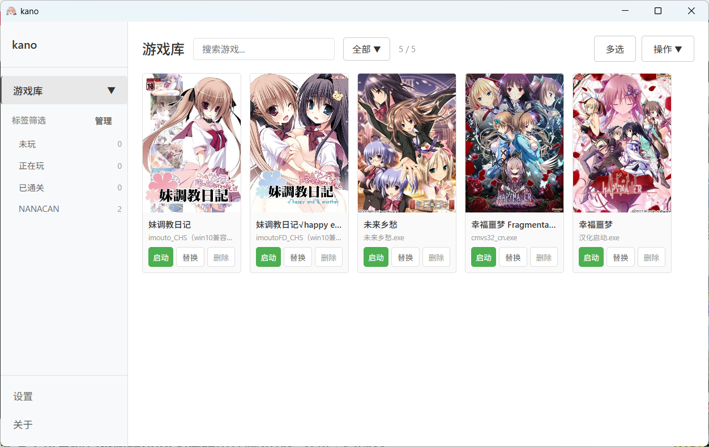
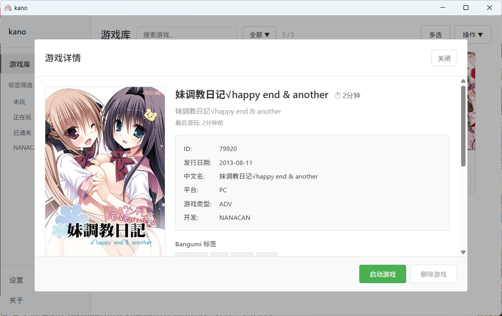

# Kano

  
  
  一个轻量简洁的Galgame管理工具
  
  
  
  

##  简介
因已知范围内大部分相关工具皆会获取到游戏的评分/评价并显示，使得自身主观判断受到影响，再无法沉浸体验某个游戏，于是开发此工具。

## 功能说明

### 游戏库功能

- 添加/删除游戏
- 游戏搜索和筛选
- 游戏详情
- 游戏时长统计

#### 游戏库界面

#### 游戏详情

##  快速开始

### 安装

1. 从 [Releases](https://github.com/shiodd/testGalManager/releases) 页面下载最新版本的安装包
2. 运行 `kano_x.x.x_x64-setup.exe`
3. 按照安装向导完成安装

### 使用

#### 添加游戏

**方式一：单个添加**
1. 点击"选择 EXE"按钮
2. 选择游戏的可执行文件
3. 游戏自动添加到库中

**方式二：批量扫描**
1. 点击"扫描文件夹"按钮
2. 选择包含多个游戏的父文件夹
3. 应用会自动识别每个子文件夹中的游戏
4. 勾选需要添加的游戏，点击"添加选中游戏"

#### 配置 Bangumi Token

为了访问完整的 Bangumi API：

1. 进入"设置"页面
2. 访问 [Bangumi 个人令牌](https://next.bgm.tv/demo/access-token) 创建 Access Token
3. 将 Token 粘贴到设置中并保存

## 已知问题

- 部分游戏可能无法正确识别

## 计划

优先级大→小
- [ ] 游戏分类/标签功能
- [ ] 记录/工具箱
- [ ] 转区打开游戏
- [ ] Steam支持
- [ ] 多语言支持
- [ ] 更多游戏信息源（如VNDB）
- [ ] 云同步功能
- [ ] 主题切换

